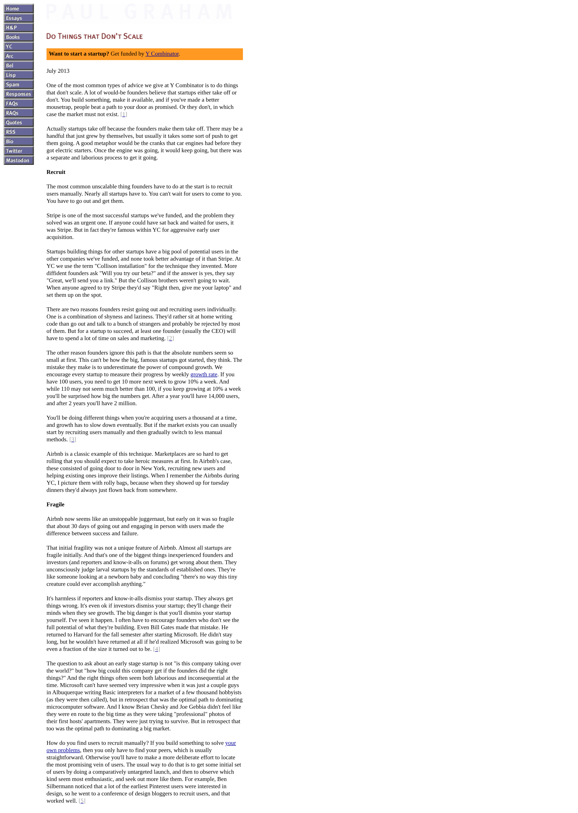
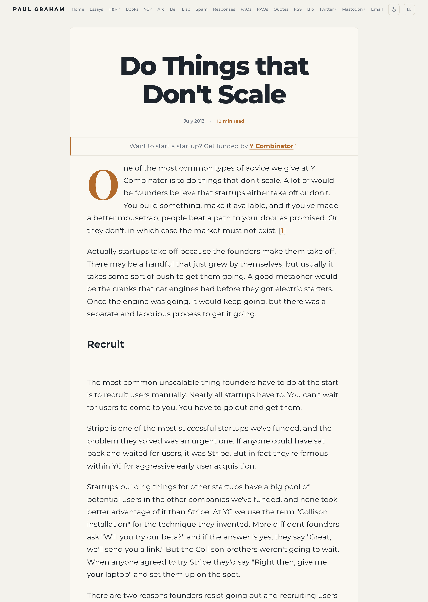
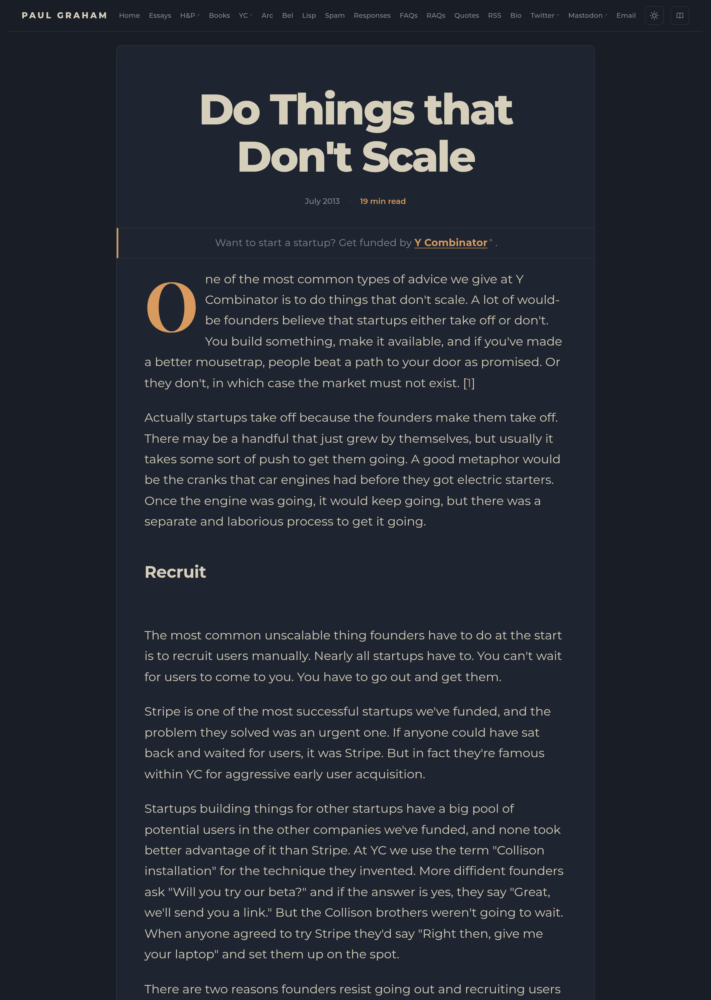

# PG Reader

Reader mode for [paulgraham.com](https://paulgraham.com) essays.

## Why

I started Y Combinator's [Startup School](https://www.startupschool.org/dashboard), which references PG's essays constantly. Reading them on the original site felt like work. I can't focus on a page unless the one thing I'm there to do sits dead-center — otherwise I bounce. So I spent three days building a Chrome extension to make reading PG's essays actually pleasant — for me, at least.

## Before / After — "Do Things that Don't Scale"

### Without extension

### With extension — light

### With extension — dark

